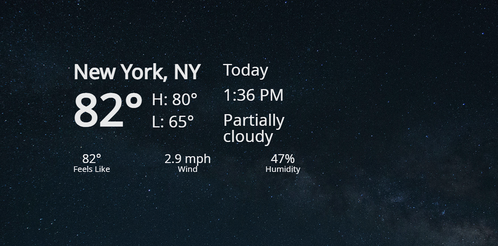

# Weather App
- Built using HTML, CSS, JS, and bundled via Webpack
- Uses the Visual Crossing API to obtain the weather from a specific region
- Uses async/await

# Weather App

Describes the weather in a particular city including temperatures, conditions, humidity, and more

Built as part of [The Odin Project](https://www.theodinproject.com/) curriculum to practice **accessing APIs for data** and **async/await**.

## Features

- Lookup a city for its weather or use current location
- See a city's weather conditions, temperatures, conditions and more

## Demo

### [Live Demo](https://songzhang015.github.io/project-12-weather-app/)

## Built Using

- HTML
- CSS
- Javascript
